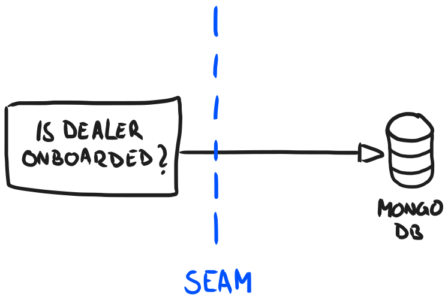

+++
title = "Testing Mastery: Fast and Secure Application Tests"
date = 2024-01-12
+++

Working in a big organisation, like Adevinta, using service oriented architecture always means interaction, either by communicating with other teams or by calling other services in code. Blink once and three microservices will have been called in that time.

Our team had the chance to build a service that takes care of onboarding car dealers to a new product we offer. The service works by subscribing to a Kafka stream that tracks dealer changes. When a change occurs, the service kicks off a process, interacting with several different systems:
- [YAMS, Adevinta's in-house media service](https://medium.com/adevinta-tech-blog/improving-your-application-performance-seamlessly-using-the-newest-image-formats-9b592c837b59)  for uploading specific documents
- MongoDB, for storing application state
- Kafka, for pushing information further downstream


In this article, I'd like to share how we currently test our services, what we learned on the way and how you can make use of our journey. To better understand how we reached this position, we must first explain what made us consider a switch.

Starting out, we wanted continuous and fast feedback for our new app. Since we interacted with a multitude of external systems, we dove right into setting up a test suite using integrated tests. This meant that they were either integration or end-to-end tests, spinning up the app in a close-to-production setup with a real database, Kafka, and HTTP servers running in separate processes.

The test suite gave us great confidence about how our application interacts with the outside world and that it's wired together as we want it to be. Things were mostly smooth sailing, but issues started to arise. Nearly all the business use cases were tested with integrated tests and the more external systems we involved, the harder it got to bring the system into a certain state needed for specific testing scenarios. Feedback loops and tests for our business logic got longer and broader over time.

We needed a change.

## The Downside of Integrated Tests

It's important to state that there is nothing inherently wrong with integrated tests. A well-tested application has passed three types of tests: unit tests, integration tests and end-to-end tests.

The problem lies in the use of integrated tests. Great tools like [testcontainers](https://testcontainers.com/)  make it incredibly easy to start docker containers from tests, but that doesn't mean every test should be an integrated one as there are downsides for local development.

### Slower Feedback Cycle

Integrated tests run slower than unit tests. Way slower when compared directly. When working, you want feedback as frequently and quickly as possible, so you don't paint yourself into a corner by pushing through one refactoring where you end up touching 34 files...


The crucial thing to understand is that infrastructure doesn't change _that_ frequently to justify running a real database on *every single* test run. One possible solution is to run them only in your deployment pipeline and make them opt-in locally via a specific environment variable.

### Trickier Setup

Setting up integrated tests is much harder than setting up unit tests. One typical occurrence is writing to a Kafka topic and having to wait one way or another for the message to be processed.

Moving all the infrastructure into a specific state to test an edge case is more complicated, especially when multiple systems are involved. While not immediately noticeable, it will take its toll on developers to test every case, since getting the system in the right state becomes harder. Why skip writing a test for it? Nobody will find out anyway, right?

### Increased Verbosity

Using integrated tests, your test code becomes harder to comprehend. This is a big problem, since tests also serve as living documentation, being a great entry point for others to understand what an application does. Littering code with pauses for certain calls to finish (e.g. waiting for a Kafka event to happen) makes the code slower and harder to read.

### Harder Maintenance


[Taken from Tenor](https://tenor.com/view/thanos-marvel-iron-man-fun-isnt-something-one-considers-when-balancing-the-universe-but-this-does-put-a-smile-on-my-face-gif-21015323)

Unfortunately I am not Thanos, and neither are you, so there's not much fun to be had when bringing an integrated environment into a specific state for an edge case. The fact that it's really hard to keep all the integration test setups running feels like you're trying to balance the universe. There's so much to monitor and it always ends up being extremely hard to maintain it. Isolation also becomes harder; you either spin up your app multiple times with different data sources or use one shared storage for all of your tests and reset it between every run.

Furthermore, chances are high that bad maintainability will lead to a [broken window effect](https://blog.codinghorror.com/the-broken-window-theory/): Since maintainability is already bad, developers stop caring about it and introduce intransparent coupling.
Here's an example: If you would be new to the codebase, reading the first test, how would you know if the chosen `DealerId` has a specific meaning?  

```kotlin
@Test
fun `fetches dealer information`() {
    api.getDealer(DealerId("539554"))
        .expectBody()
        //...
}


@Test
fun `fetches dealer information`() {
    api.createRandomDealer(DealerId("539554"))

    api.getDealer(DealerId("539554"))
        .expectBody()
        //...
}
```

**The further away the configuration of the application state from the test case, the harder it is to reason about it.**

It doesn't have to be that way. There are certain levers we can pull to make our lives and those of our colleagues easier.

## How to Write Great Tests

**Write more unit tests.** That's a bold claim, but it's true. Unit tests have all the benefits that we just identified:

- They offer a fast feedback cycle
- They are easy to set up
- They are concise and easier to grasp
- They are easy to maintain

While you might be sceptical about putting trust into unit tests, there are four rules we need to follow to make sure everything stays nice and neat.

### Rule 1: Write Testable Code

This might sound counterintuitive at first, but the way you structure production code is deeply intertwined with how easy it will be for you to set up tests. That's also why writing tests before the actual implementation (Test Driven Development) leads to a different architecture than writing the tests _after_ writing the production code.

A general rule of thumb for production code is: the more side-effect-free your code, the easier it is to test - but what does that mean? Have a look at the following code:

```kotlin
fun createDealer(id: String, email: String): Dealer? =
    if (email.contains("@")) {
        Dealer(id, email)
    } else {
        null
    }

fun createDealerInDB(id: String, email: String) {
    if (email.contains("@")) {
        db.save(Dealer(id, email))
    }
}
```

Compare the two functions. A function is side-effect-free when it always returns the same output for the same given input. Looking at our example, this is exactly what `createDealer` does. There's no hidden side effect nor state involved.
Another way to think about a side effect free function is to think about a **calculation**. In its mathematical sense, this means that it always returns the same result as long as the input stays the same.

**Actions**, on the other hand, are different: They do have side effects, meaning that, depending on the side effect, they return different outputs. This side effect is usually an external process, like a database or another service with an HTTP API.
`createDealerInDB` is an action because the call to the database could fail, leading to a runtime error.

Trying to break out calculations from actions makes code easier to reason about and also easier to test, as the example shows. Testing all corner cases of creating a dealer becomes easier if you don't have to spin up a database for it. I can highly recommend the book [Grokking Simplicity](https://grokkingsimplicity.com/), where these ideas come from and
are discussed in much greater depth.

Though we try to push side effects out, we still need them, since otherwise no real business value can be created. Let's see how we can also take care of also testing this aspect.

### Rule 2: Stay away from Mocks, use Fakes

Mocks and fakes are test doubles, which have some distinct differences. Here's an excerpt
from [Martin Fowler's article](https://www.martinfowler.com/bliki/TestDouble.html) about test doubles:

> **Mocks** are pre-programmed with expectations which form a specification of the calls they are expected to receive. They can throw an exception if they receive a call they don't expect and are checked during verification to ensure they got all the calls they were expecting.
>
> **Fake** objects actually have working implementations, but usually take some shortcut that makes them not suitable for production (an InMemoryTestDatabase is a good example).

#### The Need for Test Doubles

Test doubles are a heavily discussed topic. The main point is, since they only _pretend_ to be a real object, test doubles can give a false sense of safety and shouldn't be used. While I agree with this in principle, there is no way around test doubles if you cannot one to wait a long time for feedback.

Test doubles kick in exactly there. Using them for unit tests offers a nice balance of checking that everything is connected as expected while making sure that it's still relatively easy to reason about. Furthermore, since they run in-memory, they enable you to easily parallelise the test suite, making testing even faster.

#### Fakes vs Mocks

So, why should we choose fakes instead of mocks? The most important argument is that with fakes, you only have a single point to maintain them.  
Instead of having 64 occurrences in your whole test suite that mock the database

```kotlin
every { dbRepository.getDealer("55431") }
    .returns(Dealer(55431, "Philipp's Garage"))
```

Now you have just one component that takes care of it:

```kotlin
class FakeDealerRepository : DealerRepository {
    private val dealers: MutableMap<String, Dealer> =
        mutableMapOf()

    override fun save(dealer: Dealer): Dealer {
        dealers[dealer.dealerId] = dealer
        return dealer
    }

    override fun findAll(): MutableList<Dealer> =
        dealers.values.toMutableList()

    override fun findById(id: String): Dealer? =
        dealers[id]
}
```

Having only one place to maintain them also means that there's no variation in how they are mocked. Besides that, fakes hold real logic, so it's easier to bake real validation into them, leading to safer and more correct tests.

Using mocks also encourages an interaction-based style of testing, which leads to checking if a certain collaborator was called and that it was called with the correct parameter. Our team tries to stay away from this, since it introduces tight coupling of tests to the system under test because it checks which interactions between collaborators are happening at which moment. Whenever these interactions change, the tests also need to change.

Our team aim for behaviour-based testing, where we check that the resulting output (state), e.g. in the database, is as expected, while letting our collaborators interact as freely as they want.

### Rule 3: Untangle Business Logic from Adapter Logic

Let's circle back to what we want to achieve: a way to easily test our business logic.  
To keep it simple, we like to divide our software into two different elements: business logic and adapter logic.

**Business logic** consists of all the rules and processes that are needed to solve a certain business problem, without references to any technology.

**Adapter logic**, on the other hand, controls the connections to the technologies at hand, like Kafka. For instance, it maps the domain's types to the model needed to send it over the wire.

If all of this sounds familiar, then you might have already heard about [Hexagonal Architecture](https://alistair.cockburn.us/hexagonal-architecture/), where these concepts derive from. While there's certainly more to Hexagonal Architecture, already thinking about the separation of business and the technical adapters needed to integrate helps with designing systems.

Let's get back to our service and see what that means. Looking at the different components, we come up with the following:  
- A Kafka consumer is not our business domain  
- Our YAMS Media Storage is not our business domain  
- A database, backed by a Redis instance for caching, is also not our business domain  

Onboarding new dealers to our platform and offering separate business types *is* our business domain. But all three of them are needed to achieve our goal.  

What we're trying to do here is draw a clear line in-between our business logic and technical adapters.  



To achieve that, we want to introduce seams, a term [first coined by Michael Feathers](https://wiki.c2.com/?SoftwareSeam). Seams are meant to indicate that you're leaving one context of your application and entering another.

This means that everything that is in the business context should stay before that seam, while everything that is not part of the current business context should reside behind the seam. This could be another component in your application, like dealer subscription management, or the mapping logic needed to send an event to Kafka.

To introduce a seam, you introduce an abstraction, for example an interface.
While these seams are great for keeping clear boundaries in your code, introducing them always means extra work - do it only when you want to *isolate* something, such as your adapter layer for talking to another web service.

Seams also give guidance for other contributors, so they know where to place their code, because there are clearly defined boundaries. Let's say our database gets hit too frequently with the same queries, and we want to use Redis to add a caching layer. Having business and technical logic intertwined can make such a move hard as it's not clear where the one ends and the other starts. A seam creates the required delineation and definition for developers to follow:


Having the business domain separate from its technical adapters means that it's also much easier to write unit tests for it. You *fake* out all the adapters behind your seams with in-memory counterparts and voilà, you get fast, easy to set up and easy to maintain tests. This also allows you to parallelise the tests without any overhead, since each test case spins up its own instance.

But how do you make sure that your fakes behave like their real world implementations?

### Rule 4: Keep Fakes in Sync with Adapters

One thing to look out for when using any kind of test doubles is that they stay in sync, otherwise they're of not much help. While we have written a good fake in rule 2, we can't be 100% sure that it behaves exactly the same as the production implementation. This could lead to our fake becoming outdated, losing all of its benefits and possibly leading to production issues because of testing false assumptions.

So, what do we do when we want to make sure that both sides of the equation have the same variables? We introduce a contract.

> A **contract** is an agreement that specifies certain legally enforceable rights and obligations pertaining to two or
> more mutually agreeing parties. - [Wikipedia](https://en.wikipedia.org/wiki/Contract)

Swap out "legally" for "compiler" and we've got what interfaces do for us in the software engineering realm: they are contracts.

This applies whether you are dealing with an interface in your program or an inter-service definition like protobuf files.
Every implementation needs to adhere the rules stated in the interface, and we can make use of these definitions in our tests. Using contracts, we ensure that our fakes behave exactly like the real world, so we don't run into nasty bugs caused by inaccurate test setup. And the best thing about it: The whole test suite runs without needing mocking frameworks.

Here's an example of how this looks in practice:
```kotlin
// This makes sure that the in-memory fake and the real DB are in sync
abstract class DBContract {
    abstract val repository: DealerRepository

    @Test
    fun `inserts and finds all`() {
        val dealer = Dealer(UUID.randomUUID().toString(), "Joe")

        repository.save(dealer)

        assertEquals(listOf(dealer), repository.findAll())
    }
}

class FakeDBTest : DBContract() {
    override val repository = FakeDealerRepository()
}

// Spins up a real MongoDB via testcontainers
class MongoDBTest : DBContract() {
    // we use lazy to make sure that only one testcontainer is booted,
    // since JUnit creates a new instance for each test
    override val repository by lazy { setupMongoDB() }

    private fun setupMongoDB(): MongoDBRepository {
        val dockerImage = DockerImageName.parse("mongo:4.0.10")
        val mongoDBContainer = MongoDBContainer(dockerImage).apply { start() }
        val uri = mongoDBContainer.firstMappedPort

        return MongoDBRepository.of("mongodb://localhost:$uri")
    }
}
```
[Check the full example](https://github.com/p10r/contract-tests/blob/main/src/test/kotlin/de/p10r/DBContract.kt) for further details like how the `InMemoryDB` is created.
## Summing up

If there's one thing that this article should underline, it's the need to always validate if one is testing at the right level of abstraction.  
An integrated test should not be needed to check if on of our car dealers can be created given a set of conditions.

To keep tuning our test suite, we pushed the side effects to the edges by trying to write as many calculations as possible. Once we reached these edges, we introduced interfaces to create fakes in our tests to keep running our business-oriented tests as quickly as possible.  
This does not mean that we don't need integrated tests: they remain necessary to check that the system still runs as expected in a deployed scenario.   

While the indirection of an interface is an extra step in navigating the code, it also allows us to realise some noticeable advantages:
- Our code is easier to test, thanks to fakes
- We have introduced clear boundaries (seams) between what is adapter logic and what is business logic
- Other developers have clear guidance on where to put possible performance improvements, for example, caches

In the end, testing is always a hot topic. Some teams prefer writing only integrated tests, others rely heavily on mocking. There's nothing wrong with that as long as they can deliver value fast and don't make on-call life hard. I hope that this article gave you some insights into how our team approaches testing backend services.


Thanks to Benjamin Ruge, Mathias Fringes and Philipp Stuch for proofreading.