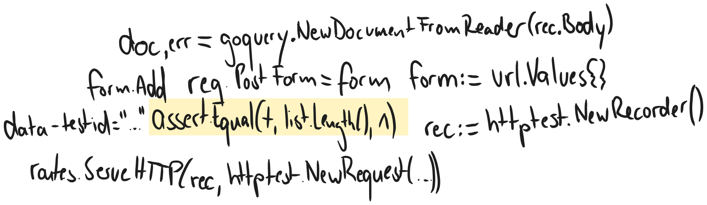

+++
title = "Use Fixtures for Blissful Tests"
date = 2025-03-02
+++

Imagine you are testing a web page where you can add URLs, which then will be rendered as a
list. The result might look like this:

```go
func TestFollowing(t *testing.T) {
    t.Run("add feed", func(t *testing.T) {
        feedStore := NewFeedStore()
        routes := ApiRoutes(feedStore)
        
        // navigate to "following" page
        rec := httptest.NewRecorder()
        req := httptest.NewRequest("GET", "/following", nil)
        routes.ServeHTTP(rec, req)
        
        doc, err := goquery.NewDocumentFromReader(rec.Body)
        assert.NoError(t, err)
        
        // check that feed list is empty
        list := doc.Find(`[data-testid="feedList"]`).Children()
        assert.Equal(t, list.Length(), 0)
        
        // add new feed
        rec = httptest.NewRecorder()
        newFeed := "https://www.example.com"
        form := url.Values{}
        form.Add("url", newFeed)
        
        req = httptest.NewRequest("POST", "/following", nil)
        req.Header.Add("Content-Type", "application/x-www-form-urlencoded")
        req.PostForm = form
        
        routes.ServeHTTP(rec, req)
        assert.Equal(t, rec.Code, http.StatusMovedPermanently)
        
        rec = httptest.NewRecorder()
        routes.ServeHTTP(rec, httptest.NewRequest("GET", "/following", nil))
        assert.Equal(t, rec.Code, http.StatusOK)
        
        doc, err = goquery.NewDocumentFromReader(rec.Body)
        assert.NoError(t, err)
        
        list = doc.Find(`[data-testid="feedList"]`).Children()
        assert.Equal(t, list.Length(), 1)
        assert.Equal(t, list.First().Text(), newFeed)
    })
}
```

While this test looks good overall, it also has one major drawback: Understanding _what_
is being tested is not easy, because one has to first read _how_ the page is being queried.
Implementation details are leaking into our test specification. Let's try to put the code
comments into actual code.

## Hiding Implementation Logic


*A cluttered test*

Tests serve as documentation. Documentation should be easy to read. The best way to achieve
this is by separating what is being tested from how it's being tested.

I like to do this via different "environments", which take care of setting up app and
offer helper functions to interact with it.

```go
type webEnv struct {
	api http.Handler
}

func newWebEnv() *webEnv {
	feedStore := NewFeedStore()
	routes := internal.ApiRoutes(feedStore)
	return &webEnv{api: routes}
}

func (ui *webEnv) goToFollowingPage(t *testing.T) *goquery.Selection {
	recorder := httptest.NewRecorder()
	ui.api.ServeHTTP(recorder, httptest.NewRequest("GET", "/following", nil))

	doc, err := goquery.NewDocumentFromReader(recorder.Body)
	if err != nil {
		t.Fatalf("could not parse doc: %v", err)
	}

	return doc
}

func (ui *webEnv) addFeed(t *testing.T, feedUrl string) {
	form := url.Values{}
	form.Add("url", feedUrl)

	req := httptest.NewRequest("POST", "/following", nil)
	req.Header.Add("Content-Type", "application/x-www-form-urlencoded")
	req.PostForm = form

	recorder := httptest.NewRecorder()
	ui.api.ServeHTTP(recorder, req)

	if recorder.Code != http.StatusMovedPermanently {
		t.Fatalf("failed to add feed: %s, status: %d", feedUrl, recorder.Code)
	}
}
```

Using this instead of creating the requests directly inside the tests is already a huge
success. To improve it even more, we can now also introduce a struct to represent the page we're testing.

```go
type FollowingPage struct {
	doc *goquery.Document
}

func NewFollowingPage(doc *goquery.Document) *FollowingPage {
	return &FollowingPage{doc: doc}
}

func (p *FollowingPage) FeedList() *goquery.Selection {
	return p.doc.Find(`[data-testid="feedList"]`)
}
```

The updated test will now look as follows:

```go
func TestFollowingPage(t *testing.T) {
	t.Run("add feed", func(t *testing.T) {
		ui := newWebEnv()

		page := ui.goToFollowingPage(t)
		assert.Equal(t, page.FeedList().Children().Length(), 0)

		newFeed := "https://www.example.com"
		ui.addFeed(t, newFeed)

		page = ui.goToFollowingPage(t)
		assert.Equal(t, page.FeedList().Children().Length(), 1)
		assert.Equal(t, page.FeedList().Children().First().Text(), newFeed)
	})
}
```

Looking at the final result, we have improved our test in multiple aspects:

- The test is easy to read
- The test will not need to change when there is a change in the implementation
- It's cheaper to maintain: There's now a single place focusing on interactions with the app
- `data-testid` and other page-specific helpers are now centralised in one place, which is
  `FollowingPage` 
- `webEnv` and `followingPage` can be easily reused across the test suite
