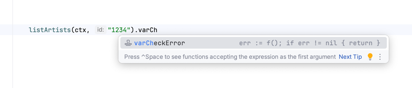
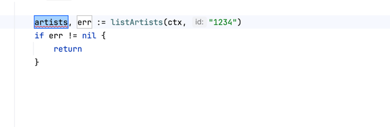
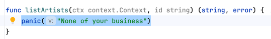
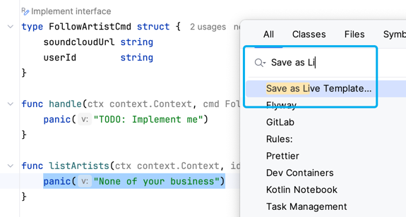

+++
title = "Hidden Gem: IntelliJ's Live Templates"
date = 2025-07-05
+++

IntelliJ IDEA is a beauty of an IDE. One feature which I see people rarely use is
called ["Live Templates"](https://www.jetbrains.com/help/idea/using-live-templates.html).
The IDE comes with tons of them already installed. Let's have a look!

## Using Live Templates

Say you want to call the following function:

```go
func listArtists(ctx context.Context, id string) (string, error) {
// implementation
}
```

You would need to call it, assign the result to a variable and handle the error. Lots of
tedious work.

Live Templates come in handy here. When writing the function call, extend it by typing
`.varCheckError` and it will do all of that automatically for you:



Once you hit Enter, IntelliJ will do its completion and lets you tab through the names of the
variables and the return inside the error block.



## Adding New Live Templates

If you find yourself writing the same code over and over again, it might be time to add it as a
live template.
One recent example for me is that I like to throw in a little `panic("TODO: Implement me")` in
a function, just to satisfy the compiler for a second.

To add a new template:

Highlight the code you want to have as a template



Hit double shift/"Search Everywhere" and type in "Save as Live Template".



## Adding Parameters to Live Templates

If you go to `Settings > Editor > Live Templates`, you also get an editor to add Live
Templates, which is helpful when defining parameters inside your templates.

Parameters need to be enclosed by dollar signs. Here's one of my Live Templates for creating a
test in Go:

```
// Type "trun" to trigger it
t.Run("$NAME$", func(t *testing.T) {
	$END$	
})
```

Upon hitting Enter, the cursor will first jump to `$NAME$`, which you then set and after
hitting Enter for a second time, the cursor will jump to `$END$`.

Overall, the process is really intuitive, and in case one hits a road block, they can just
scroll through the existing Live Templates.

## My Top 5 Live Templates

1. Kotlin/Java: `.val` to create values. `"1234".val` becomes `val <your name here> = "1234"`
2. Kotlin/Java: `.sout` after a command will auto-complete the code to `println(variable)`
3. Go: `.varCheckError` to create a variable and check the error result
4. Go (custom): `trun` to create a test (see above)
5. Kotlin/Java (custom): `.debug` will add a `.also(::println)` to the end of a statement,
   which is handy since it doesn't change the return type of the value, unlike `.sout`.

Have fun experimenting!

Philipp